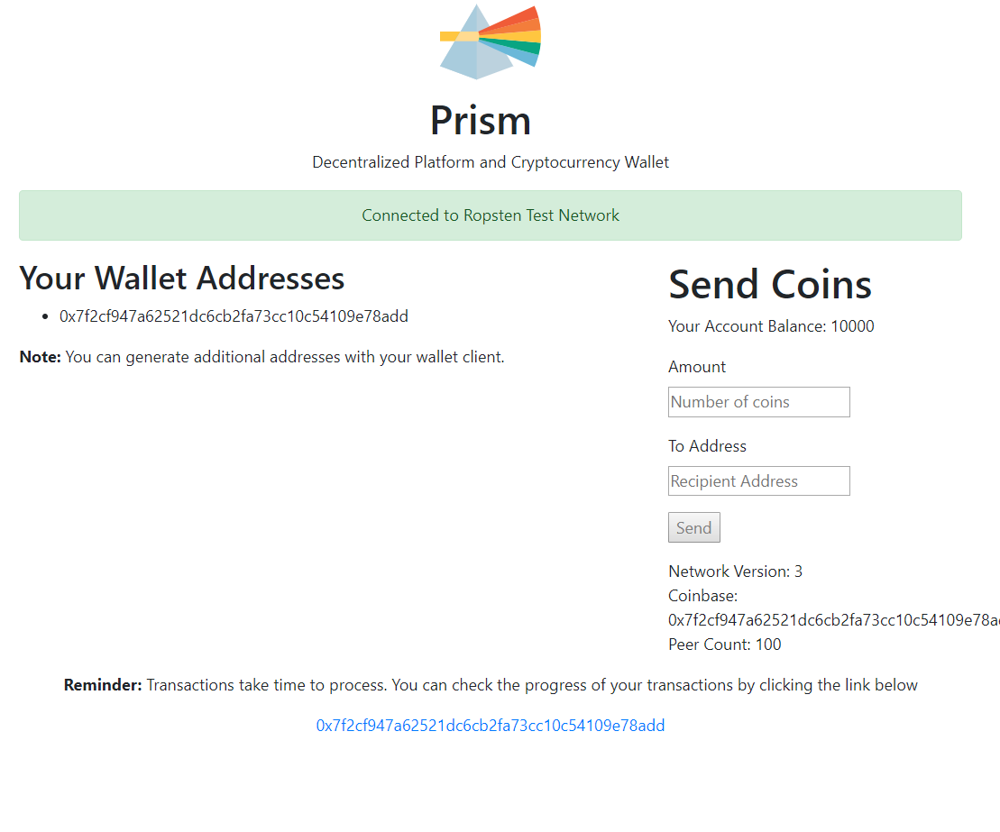

# Prism Distributed App (built with Ethereum and IPFS)

https://ipfs.io/ipfs/QmQrPfFovKshKSYCy9kzUs3XPu2NpbqrBcM1HoYytASd9k

This is an application I've been developing to help me learn more about the Ethereum protocol and DAPP development.



This decentralized application uses AngularJS with the truffle framework (smart contract management and deployment).

Click the link below for a live version on IPFS (Install the metamask chrome extension and choose the Ropsten Test Network)

https://ipfs.infura.io/TBD

## Dependencies

### Metamask

You will need to install the Metamask chrome extension in order to connect to the Ethereum network in your browser.

### IPFS

You will need to install Go and IPFS to publish to the decentralized web. Instructions here https://gist.github.com/drwasho/ca224cbd4a21440f7cc1245e594398e4

## Installation

In the root directory

1. `npm install` to install dependent libraries
1. `truffle compile` to compile your contracts in to the ./build directory.
2. `truffle migrate` to deploy those contracts to the network. The contracts will be automatically deployed to the development network in `./truffle-config.js`
3. `ng serve`. Navigate to http://localhost:4200/
4. Make sure there are no errors in browser console

## Build

Run `ng build` to build the project. The build artifacts will be stored in the `dist/` directory. Use the `-prod` flag for a production build.

## Running unit tests for Angular App and for the Solidity Smart Contracts (.sol files)

1. Run `ng test` to execute the unit tests via [Karma](https://karma-runner.github.io).
2. Run `truffle test` to run tests associated with your solidity smart contracts. The test folder for this can be found in the `test` directory at the root level of this project

## Running end-to-end tests

Run `ng e2e` to execute the end-to-end tests via [Protractor](http://www.protractortest.org/).
Before running the tests make sure you are serving the app via `ng serve`.

# Configuration

You will need an API key from Infura (provides Ehtereum and IPFS Nodes for your app). https://infura.io/

When you get your copy put it in ./truffle-config.js

You will also need your seed words in order to deploy contracts using your private keys. Just use the ones from your Metamask browser extension.

## Deploying your contracts to the Test and Live Networks

Configuration - ./truffle-config.js

http://truffleframework.com/tutorials/deploying-to-the-live-network - A guide to deploying contracts with Truffle.
http://truffleframework.com/tutorials/using-infura-custom-provider - Using a custom provider (In our case Infura).

Take a look at truffle-config.js - this contains all of the different configurations for each network. 

I decided to use Infura so that I don't have to run an Ethereum node locally.

You will need to top up your Ethereum wallet with coins for the test network you choose to use in Metamask. There is a faucet for issuing test coins https://faucet.metamask.io/

```$xslt
truffle migrate --network ropsten
truffle migrate --network kovan
truffle migrate --network rinkeby

and of course the live ethereum network: WARNING uses real coins.

truffle migrate --network mainnet
```

Reminder: None of these will work without your Metamask seeds and Infura API key set up in truffle-config.js

## Publishing to IPFS

You will need to IPFS command line tool installed. In the root directory run the following command..

```$xslt
ipfs add -r dist
ipfs name publish <hash-generated-from-previous-command>
ipfs name resolve <hash-generated-from-previous-command>
```

In the example above you can see that a hash is generated. You will be able to use this hash to find your app on the distributed network.

Just visit https://ipfs.io/ipfs/<your-generated-hash>

## Ethereum Development Notes

### Web3.js Useful API

#### LevelDB Database

There is a LevelDB database which can be used to store data offline. It uses a simple key-value store

```$xslt
web3.db.putString('testDB', 'key', 'myString') // true
```

#### Whisper

https://github.com/ethereum/wiki/wiki/Whisper - Whisper Wiki
https://www.youtube.com/watch?v=koZizelOUeI - Whisper: Achieving Darkness Presentation at DevCon

In short, Whisper is a peer to peer protocol for sending messages over the ethereum network anonymously and without censorship.

#### Swarm

http://swarm-guide.readthedocs.io/en/latest/introduction.html - Introduction to Ethereum Swarm

#### Solidity

Solidity is the language for writing smart contracts that get executed on the EVM (Ethereum Virtual Machine).

https://manojpramesh.github.io/solidity-cheatsheet/ - A handy cheat sheet

#### ENS (Ethereum Name System)

https://ens.readthedocs.io/en/latest/ - Ethereum Name System Documentation. Like DNS but for Ethereum.

## Resources / Documentation / Code Repositories

https://github.com/LedgerHQ/ledger-wallet-api - Ledger Wallet JS API (Appears to be BTC only, can use Ledger Nano to send and receive funds, access account balances etc)
http://truffleframework.com/tutorials/using-infura-custom-provider - Using Infura with Truffle
https://github.com/raineorshine/solgraph - Check for security vulnerabilities within your smart contracts.
https://github.com/diasdavid/ipscend - Publish your static content to IPFS easily.

## IPFS Public Nodes

https://ipfs.io
https://ipfs.infura.io 

## Donate

0x7f2cf947a62521dc6cb2fa73cc10c54109e78add - Ether
